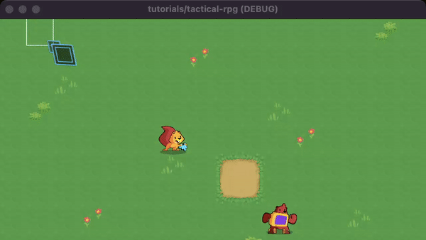

# Godot Tactical RPG Example

Uses **Godot 4** and **C#**.

## About

This is a Godot 4 project based on a
[Godot 3 tutorial from GDQuest](https://www.gdquest.com/tutorial/godot/2d/tactical-rpg-movement/).

I adapted the tutorial from GDScript to C#, accounting for API changes from
Godot 3 to 4.

This demo implements a 2D grid which can contain units. Units may be selected,
which will show their allowed movement range with a flood fill algorithm. 
Clicking on a tile will generate the shortest path using the A* algorithm,
then render an arrow showing the path. Clicking again will move the unit.

## Licenses

Code: GPLv3

Art Assets: CC-BY 4.0, from GDQuest and contributors (https://www.gdquest.com/)
